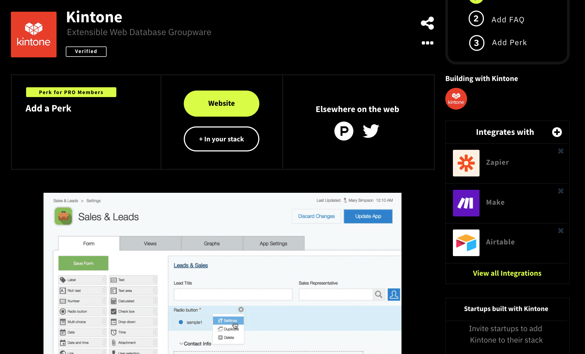

## Task
- Compare AirTable's NCF profile
- Figure out what we need to do
- Improve Kintone's NCF Profile
  
https://bozuman.cybozu.com/k/#/space/3815/thread/74094/4018126

### Airtable

* Have perk for PRO members
* Does not have producthunt page
* Have [twitter](https://twitter.com/airtable) page
* Possible integration tools: **24** can be found in NCF
* Building with Airtable have 249+ people. 
* Does not have descriptions
* Have 120 no-code startups
* Have many courses: ["No-Code MVP"](https://nocodefounders.com/course/no-code-mvp), ["100DaysofNoCodeBeginner's"](https://nocodefounders.com/course/100-days-of-no-code-beginners-course) etc
* Have many tutorial videos

### Kintone

* Does not have perk for PRO members
* Have [producthunt](https://www.producthunt.com/products/kintone) page
* Have [twitter](https://twitter.com/kintone) page
* Possible integration tools: **7** can be found in NCF
* Building with Kintone: only our icon
* Have description with images and video
* Does not have no-code startups
* Does not have courses
* Have Kintone overview demo video in the description but no tutorial videos

### What to do
* Change Profile Slogan  
  * Your business + No Code Database = Love Your Data
  * Your Idea. No Code. No problems.
  * Your data + Kintone = 💪
  * Kintone for any solution.
  * Manage your team with a no-code solution???
  * in producthunt -> Build custom business applications without code

* Add perks  
  If possible, to push NCF people for an easier start

* Increase "Building with people" , "no-code startups", and "courses"  
  These are the things that appear in the profile when someone build startups or create courses using kintone.  
  Especially "Building with people" is on the top right of the profile, it helps new people think many people are using this tool.   
  What is startups? Products or startups that are developed using no-code platforms.  
  Do we have any product we can share or partners in the US?

* Add more integrations  
  We should check if Kintone works with other tools (Tools that developers/no-code users in US often use). Currently we have zappier, make, google drive, slack, etc tools that are very well known.

* Add video tutorials  ß
  If we have beginner tutorials / starter videos of Kintone, we should add them
  - how to use kintone
  - easy example of Kintone on a system
  - integration with other apps
  - "How to" videos
  - add "without code" or "with no developer" on the title
  - Testimonials
  - Do we use US kintone's [videos](https://www.youtube.com/@kintoneglobal/videos) or KDP's [videos](https://www.youtube.com/@KintoneDeveloperProgram/videos)
  - Videos to add:
    - I wanted to add [Sign up for Kintone Developer Program & Developer License](https://www.youtube.com/watch?v=Gzz8SbTuoFg) but it's using the old website
    - [Kintone Product Introduction Video](https://www.youtube.com/watch?v=2Q5KTZuuqmo)
    - [What Will You Build on Kintone](https://www.youtube.com/watch?v=8SAy4L1QXz8)
    - [How Kintone helped Congo Brands scale their business](https://www.youtube.com/watch?v=xGPsVmxRMb8)
    - 